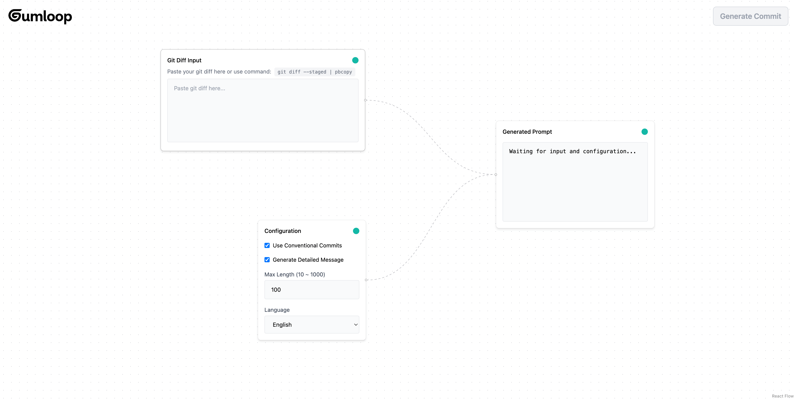

# Gumloop Coding Challenge - AI Commit Message Generator

A visual tool that helps developers generate better git commit messages using AI. Built with React Flow and Google's Gemini AI.



## Features

- Visual node-based interface for configuring commit message generation
- Supports both Conventional Commits and free-form formats
- Customizable message length and detail level
- Supports both English and Chinese languages
- Real-time prompt preview

## Getting Started

1. Get your API key from [Google AI Studio](https://aistudio.google.com/app/apikey)

2. Clone this repository

3. Copy the environment file and add your API key:

```bash
cp .env.example .env.local
```

4. Install dependencies:

```bash
pnpm install
```

5. Start the development server:

```bash
pnpm dev
```

## Usage

1. Paste your git diff in the input node (use `git diff --staged | pbcopy` to copy staged changes)

2. Configure your preferences in the config node

3. Click "Generate Commit" to create your commit message

4. Copy the generated message to use in your commit
